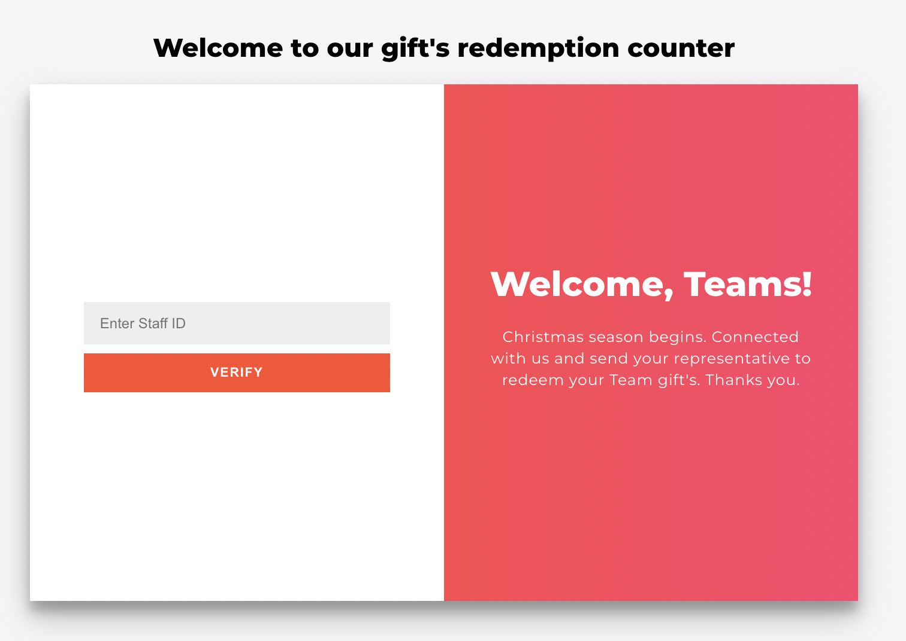
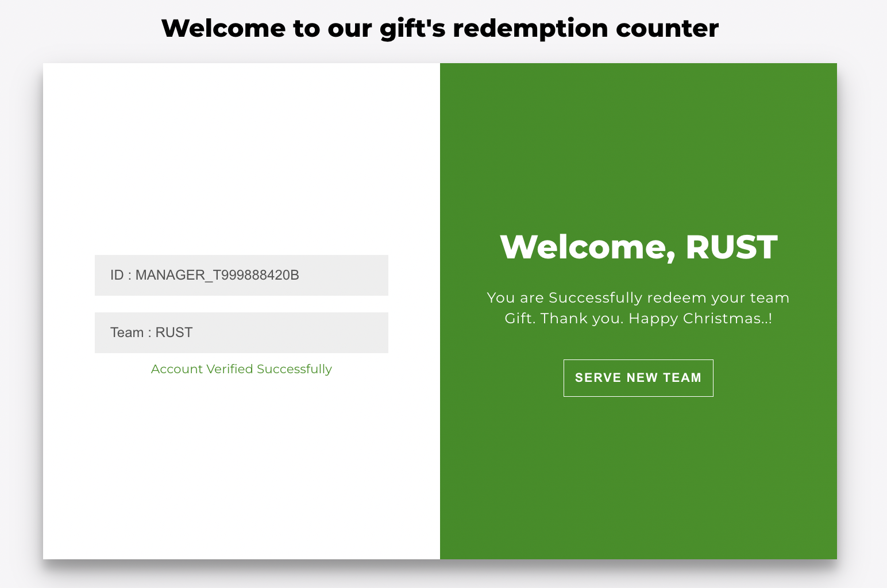
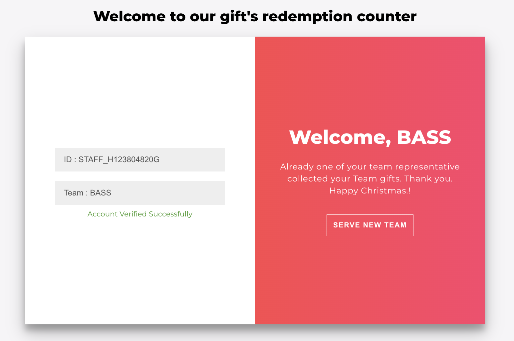

### Step 1 - Clone the repository:

From the command line, clone the repository:

```sh
$ git clone https://github.com/jayashibus/giftredeem.git
```

### Step 2

```sh
npm install
```

### Step 3

```sh
npm start
```

The Application Runs on localhost:3000

### Frontend Flow

Home page there have a input field to key in Staff ID



Entered staff id will be validated in the backend. If the team haven't collected the gift yet then Gift redeem page will show with Redeem Gift button.


After successfull redeemption will get successfull message and will get new button "Serve New Team" to navigate home page.



If the team already collected the gift then will apear this page with message.



### step 4

```sh
npm run server
```

### Step 5

```sh
CREATE DATABASE giftredeem;
```

```sh
CREATE TABLE `staff_details` (
`staff_pass_id` varchar(255) NOT NULL,
`team_name` varchar(255) NOT NULL,
`created_at` varchar(255) NOT NULL
) ENGINE=InnoDB DEFAULT CHARSET=utf8mb4;
```

```sh
INSERT INTO `staff_details` (`staff_pass_id`, `team_name`, `created_at`) VALUES
('STAFF_H123804820G', 'BASS', '1623772799000'),
('MANAGER_T999888420B', 'RUST', '1623772799000'),
('BOSS_T000000001P', 'RUST', '1623872111000');
COMMIT;
```

```sh
CREATE TABLE `redemption` (
`staff_pass_id` varchar(255) NOT NULL,
`team_name` varchar(255) DEFAULT NULL,
`redeemed_at` varchar(255) NOT NULL
) ENGINE=InnoDB DEFAULT CHARSET=utf8mb4;
```

### Step 6

Update DB details in server/router/index.js Line 5

```sh
const db = mysql.createConnection({
host: "localhost",
user: "root",
password: "",
database: "giftredeem",
});
```

### Unit Testing

```sh
npm run test
```

### Dependencies

You will need:

- node
- axios
- mysql

Dev Dependencies

- express
- http-proxy-middleware
- nodemon
